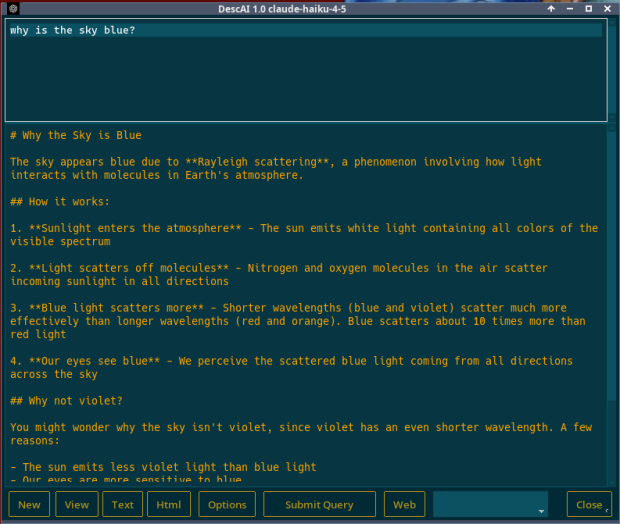
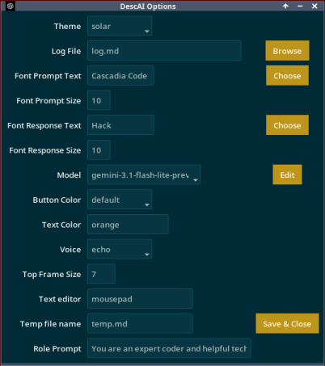
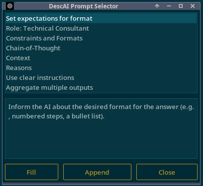

# DescAI

### a GUI desktop AI client  
>#### Converse with cloud based LLMs 
>##### Openai Google anthropic Ollama Groq

-  Temporary local Chat Mode
-  Supports a variety of OpenAI models and web-search
-  Supports Claude models and web-search
-  Convert responses to HTML or VOICE
-  Maintains a log of reponses
-  Simple GUI
-  Renders HTML from Markdown
-  Choose from many themes and colors
-  Pop-up Prompt Manager | Options Manager

see https://platform.openai.com for OpenAI model information  
see https://www.anthropic.com for information on Claude models

_requires several modules_  

        anthropic==0.84.0
        openai==2.28.0
        google-genai==1.68.0
        ollama==0.6.1
        Markdown==3.10.2
        ttkbootstrap==1.14.2
        groq==1.1.2

_Uses Python and tkinter_

>python3  
>python3-tk

aditional requirements:

        text editor
        
        VNC media player
        
        Internet and Internet browser

**Tested on Windows and Linux**

----

## Instalation

Use `pip` to install any missing python modules
needed for API access. Consult the vendor for
the correct `pip...` syntax.

Also you will need **_API keys_** from each vendor.  
The vendors offer both free and paid tiers.  
Here are the vendors, websites, and key labels to use:

| Vendor | Website | ENVariable | 
| :--- | :--- | :--- |
| OpenAI | https://platform.openai.com | **OPENAI_API_KEY** |
| Anthropic | https://claude.ai/settings | **CLDKEY** |
| Google | https://aistudio.google.com | **api_key** |
| Ollama | https://ollama.com/settings | **OLLAMA_API_KEY** |
| groq | https://console.groq.com/keys | **GROQ_KEY** |

Windows and Linux have various way to set these variables.

---

## Voice

If you plan to use Voice reading of responses, you will need to install VLC media player.

Use Ctrl-Shift-S to play back the reponses.

Each play-back is saved in a separate file in the application directory.

---

## Options

The `options.ini` file contains all of the options settings.

There is a GUI that handles options but can use a text editor also.  

---

## Buttons

- **New**
> Begins a new conversation  
>>To change the system role message for the current session,  
type **_prompt You are a .......... assistant_**  
into the Prompt Area first, and then click "New".
- **View**
> Displays the log file you named in Options.
- **Text**
> Opens the current response or selection in your text editor   
Set up the name of your text editor in _options_.
- **Html**
> Converts the current response or selection to HTML
and opens it in your default browser.
- **Options**  
> launches the Options editing program
- **Submit Query**
> Submits prompt to the current AI Model
>> Ctrl-G and Ctrl-Enter do that too.
- **Web**
> Toggle the "**web**-search" tool
>> **NOTE:** works with most OpenAI models,  
>> Claude Sonnet, Claude Opus, and groq/compound
- **Select _temporary_ Model**
> Select from models listed in `models.dat` text file  
Selecting a different model forces a new conversation
>> _On startup the "default" model is always selected_  
The default model is set in options (`options.ini`)
- **Close**
> Exit the program. _Ctrl-q_ exits the program without confirmation.

---

## Context menu

Right-Click in the prompt or response area to get a bunch of useful choices.

---

### Setting options from the app

## Operation

At startup, if a previous conversation is detected the user is prompted
to either continue or start a new conversation. So closing the app does
not terminate a conversation. To start a new conversatioin while
the app is running use the **'New'** button. Multiple conversations are not
preserved anywhere, but will remain in the log until it is purged.

## Hot Keys

| key | action |
| :--- | :--- |
|__Ctrl-H__| This HotKey help|
|__Ctrl-Q__| Close Program No Prompt|
|__Ctrl-Shift-D__| Delete Log File|
|__Ctrl-Shift-S__| Speak the Currrent Text|
|__Ctrl-G__| Submit Query (Button)|
|__Ctrl-Enter__ | Submit Query (Button)|
|__Ctrl-F__| Find text |
|__Ctrl-N__| Find next text |
|__Ctrl-J__| Open Selected URL |
|__Ctrl-R__|Clear Prompt Area|
|__Alt-P__|Open Prompt Manager|

The `prompts` directory is for storing custom prompt text.
Prompt files must begin with "prompt" and be followed by non-space characters, like `prompt1` or `promptX`.
You can easily edit your prompt?.md files with a text editor.

In addition, a ___Prompts Manager___ presents named prompts that are created and modified in a file
called `prompts.txt`.

----

END
